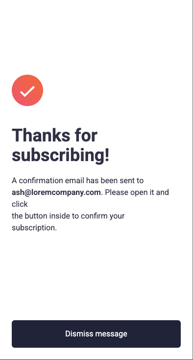

# Frontend Mentor - Newsletter sign-up form with success message solution

This is a solution to the [Newsletter sign-up form with success message challenge on Frontend Mentor](https://www.frontendmentor.io/challenges/newsletter-signup-form-with-success-message-3FC1AZbNrv). Frontend Mentor challenges help you improve your coding skills by building realistic projects. 

## Table of contents

- [Frontend Mentor - Newsletter sign-up form with success message solution](#frontend-mentor---newsletter-sign-up-form-with-success-message-solution)
  - [Table of contents](#table-of-contents)
  - [Overview](#overview)
    - [The challenge](#the-challenge)
    - [Screenshot](#screenshot)
    - [Links](#links)
    - [Built with](#built-with)
    - [What I learned](#what-i-learned)
    - [Useful resources](#useful-resources)
  - [Author](#author)

**Note: Delete this note and update the table of contents based on what sections you keep.**

## Overview

### The challenge

Users should be able to:

- Add their email and submit the form
- See a success message with their email after successfully submitting the form
- See form validation messages if:
  - The field is left empty
  - The email address is not formatted correctly
- View the optimal layout for the interface depending on their device's screen size
- See hover and focus states for all interactive elements on the page

### Screenshot





### Links

- Solution URL: [Add solution URL here](https://your-solution-url.com)
- Live Site URL: [Add live site URL here](https://your-live-site-url.com)

### Built with

- Semantic HTML5 markup
- CSS custom properties
- Flexbox
- CSS Grid
- Mobile-first workflow
- Javascript
- [Tailwind](https://tailwindcss.com/) - A utility-first CSS framework


### What I learned

I learned to write a better syntaxe structure but I wasn't able to mimic the error state like in de design.

```javascript
// Email verification
if (!verifyEmail(email)) {
  // Error Message
  const error = document.createElement('p');
  error.classList.add('text-red', 'font-bold', 'text-xs');
  error.textContent = "Valid email required";

  // Add a message next to mail label
  mailLabel.appendChild(error);

  // Add class to the error message
  // If anyone to do that part the correct way I'll be glad to have some feedback
  mailInput.classList.remove('border-gray-400/90');
  mailInput.classList.add('bg-red-200', 'text-red-600', 'border-red-500');
  mailInput.value.textContent = " ";
  return;
}

// Styles reset
mailInput.classList.remove('bg-red-200', 'text-red-600', 'border-red-500');
mailInput.classList.add('border-gray-400/90');
```

### Useful resources

- [Tailwind Doc](https://tailwindcss.com/) - This helped to write CSS faster.
- [ChatGPT](https://chatgpt.com/) - Chat helped me to organize my js syntaxe 


## Author

- Website - [@solakabuta](https://www.solakabuta.com)
- Frontend Mentor - [@SolaKabuta](https://www.frontendmentor.io/profile/SolaKabuta)
- Twitter - [@sola_kabuta](https://x.com/sola_kabuta)
